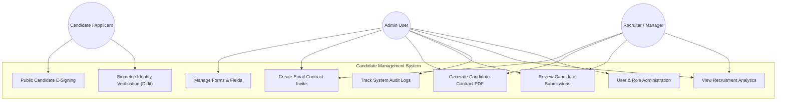
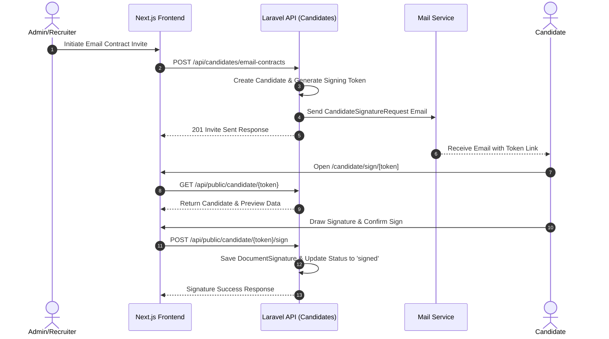
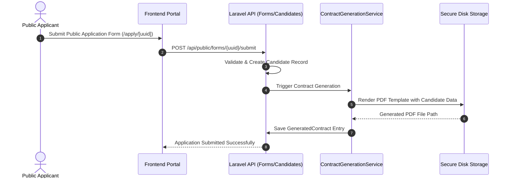
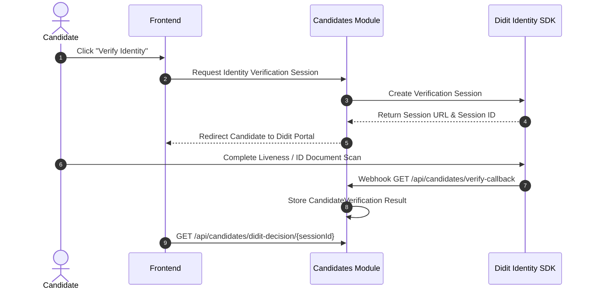
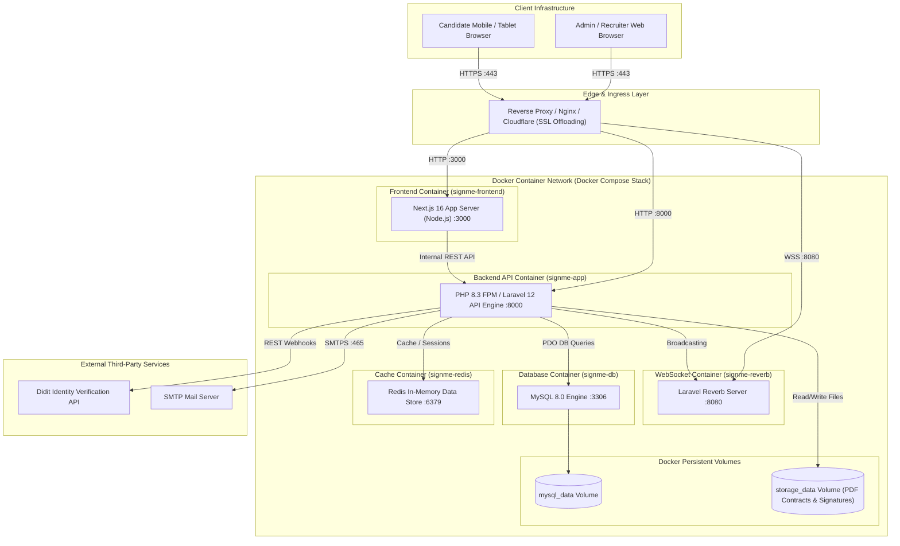

# Candidate Management & Contract Automation System

A robust, enterprise-grade Candidate Management and Contract E-Signing platform. Built with a **Domain-Driven Laravel 12 Backend** and a modern **Next.js 16 (App Router) Frontend** with a centralized Global API Service layer.

---

## 🎯 Point of the Codebase

The platform streamlines candidate onboarding, document generation, and digital identity verification:
1. **Candidate Onboarding & Form Builder**: Dynamic form creation, custom fields, role-based form assignments, and public candidate submission portals.
2. **Automated Contract Generation & E-Signing**: Template-based PDF generation (via TCPDF/FPDI), real-time document locking, canvas-based digital signatures, and public tokenized signing links.
3. **Identity Verification Integration**: Third-party biometric identity verification via **Didit SDK** integration.
4. **Role-Based Access Control (RBAC)**: Fine-grained user permissions and role filtering powered by `spatie/laravel-permission`.
5. **Audit Logging & Analytics**: Complete activity trail (`AuditLog`) for tracking system actions and visual candidate analytics dashboards.

---

## 📂 Project Structure

```
candidate-managment-system/
├── src/
│   ├── backend/                      # Laravel 12 Domain-Driven Modular API
│   │   ├── app/
│   │   │   ├── Console/              # Artisan commands
│   │   │   ├── Http/Middleware/      # Global API middleware
│   │   │   ├── Mail/                 # Transactional Email Notification templates
│   │   │   ├── Models/               # Core models (User)
│   │   │   ├── Modules/              # Domain-Driven Modules
│   │   │   │   ├── Analytics/        # Analytics endpoints & metrics
│   │   │   │   ├── Audit/            # System audit logs & filtering
│   │   │   │   ├── Auth/             # Sanctum authentication & login
│   │   │   │   ├── Candidates/       # Candidate CRUD, contracts & Didit verification
│   │   │   │   ├── Forms/            # Dynamic forms, fields & contract templates
│   │   │   │   ├── Notifications/    # In-app notifications
│   │   │   │   ├── Signing/          # Digital signatures & document signing
│   │   │   │   └── Users/            # User administration, roles & permissions
│   │   │   └── Providers/
│   │   │       └── ModuleServiceProvider.php # Auto-registers module routes/migrations
│   │   ├── config/                   # Laravel configurations
│   │   ├── database/                 # Migrations & seeders
│   │   └── routes/                   # Core API routes loader
│   │
│   └── frontend/                     # Next.js 16 App Router Frontend
│       ├── app/                      # Next.js App Router pages
│       │   ├── (auth)/login/         # Authentication view
│       │   ├── apply/[uuid]/         # Public candidate application portal
│       │   ├── candidate/sign/[token]/ # Tokenized public candidate signing view
│       │   └── dashboard/            # Admin & Recruiter dashboard layout & sub-pages
│       ├── components/               # UI components
│       │   ├── candidates/           # Candidate detail & list cards
│       │   ├── dashboard/            # Dashboard analytics charts & widgets
│       │   ├── forms/                # Form builder & contract layout editor
│       │   ├── signing/              # Signature pad & PDF viewer
│       │   └── ui/                   # Reusable UI primitives (Shadcn/Radix UI)
│       ├── context/                  # Language & global context providers
│       ├── hooks/                    # Custom React hooks (useAuth, useMobile, useToast)
│       └── services/api/             # Global Centralized API Layer
│           ├── client.ts             # Axios client with CSRF token interceptors
│           ├── auth.api.ts           # Auth domain API
│           ├── candidates.api.ts     # Candidates domain API
│           ├── forms.api.ts          # Forms domain API
│           ├── users.api.ts          # Users domain API
│           ├── signing.api.ts        # Signing domain API
│           ├── analytics.api.ts      # Analytics domain API
│           ├── audit.api.ts          # Audit domain API
│           ├── notifications.api.ts  # Notifications domain API
│           └── index.ts              # Global API exporter
└── README.md
```

---

## 🎭 Use Case Model



---

## 📐 Class Model (Domain Entity Relationships)

```mermaid
classDiagram
    class User {
        +int id
        +string name
        +string email
        +boolean force_password_reset
        +roles()
    }

    class Candidate {
        +int id
        +int form_id
        +int assigned_to
        +string name
        +string email
        +string contract_status
        +string signing_token
        +dateTime sent_for_signature_at
        +dateTime signed_at
        +json data
        +signature()
        +form()
        +generatedContracts()
    }

    class Form {
        +int id
        +int role_id
        +string uuid
        +string title
        +string description
        +fields()
        +contracts()
    }

    class FormField {
        +int id
        +int form_id
        +string label
        +string type
        +boolean is_required
    }

    class FormContract {
        +int id
        +int form_id
        +string title
        +string template_path
    }

    class GeneratedContract {
        +int id
        +int candidate_id
        +int form_contract_id
        +string file_path
        +string status
    }

    class DocumentSignature {
        +int id
        +int candidate_id
        +int user_id
        +string signature_path
        +string ip_address
    }

    class CandidateVerification {
        +int id
        +int candidate_id
        +string didit_session_id
        +string status
        +json decision_data
    }

    class AuditLog {
        +int id
        +int user_id
        +string action
        +string auditable_type
        +int auditable_id
        +string ip_address
    }

    User "1" -- "*" Candidate : assigns
    Form "1" -- "*" Candidate : creates
    Form "1" -- "*" FormField : contains
    Form "1" -- "*" FormContract : template_for
    Candidate "1" -- "*" GeneratedContract : produces
    Candidate "1" -- "0..1" DocumentSignature : signs
    Candidate "1" -- "0..1" CandidateVerification : verifies
    User "1" -- "*" AuditLog : performs
```



---

## 🔄 Sequence Models for Workflows

### 1. Candidate Invitation & Public E-Signing Sequence



---

### 2. Form Submission & Contract Generation Sequence



---

### 3. Didit Biometric Identity Verification Flow



---

## 🚀 Deployment Diagram



---


## ⚡ Quick Start & Setup

### 🐳 Option 1: Quick Start with Docker (Recommended)

The repository includes a pre-configured multi-container Docker setup (`src/docker-compose.yaml`) with **Laravel App API**, **Next.js Frontend**, **MySQL 8.0**, **Redis**, and **Laravel Reverb WebSocket server**.

1. **Environment Setup**:
   ```bash
   cd src
   cp backend/.env.example backend/.env
   cp frontend/.env.local.example frontend/.env.local
   ```

2. **Configure environment variables** in `src/backend/.env`:
   - Set required values: `APP_KEY`, `DB_DATABASE`, `DB_USERNAME`, `DB_PASSWORD`, `MAIL_HOST`, `MAIL_FROM_ADDRESS`.

3. **Start Container Stack**:
   ```bash
   cd src
   docker compose up -d --build
   ```

4. **Run Database Migrations & Key Generation** (First-time setup):
   ```bash
   docker exec -it signme-app php artisan key:generate
   docker exec -it signme-app php artisan migrate --seed
   ```

5. **Access Application**:
   - **Frontend App**: `http://localhost:3000` (or `https://signmehere.cloud`)
   - **Backend API**: `http://localhost:8000` (or `https://api.signmehere.cloud`)

---

### 💻 Option 2: Local Development Setup

#### Backend (Laravel 12)
```bash
cd src/backend
composer install
cp .env.example .env
php artisan key:generate
php artisan migrate
php artisan serve
```

#### Frontend (Next.js 16)
```bash
cd src/frontend
npm install
cp .env.local.example .env.local
npm run dev
```

---

## 🔑 Default Seeded Credentials

When running seeders (`php artisan db:seed` or `php artisan migrate --seed`), the following test accounts are automatically generated:

| Role | Email Address | Default Password | Access Privileges |
| :--- | :--- | :--- | :--- |
| **Admin User** | `admin@signme.com` | `password` | Full Administrative & System Management Access |
| **Worker User** | `worker@signme.com` | `password` | Recruiter & Candidate Management Access |


